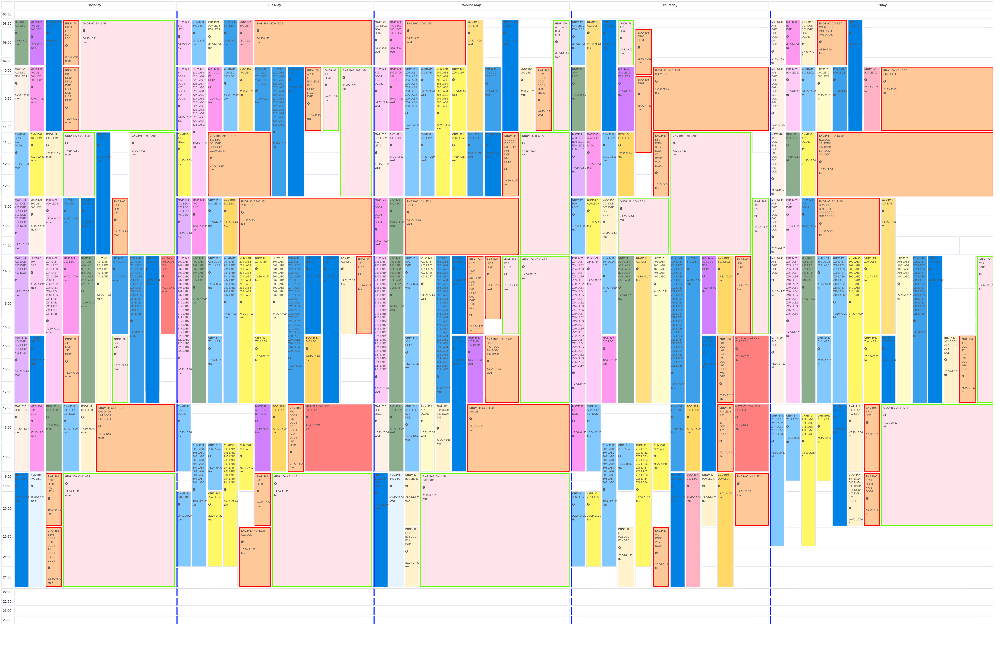

# uOttawa Faculty of Science Timetable Planner

* Project is forked from https://github.com/catmanjan/anutimetable

## Summary

This tool is dedicated to faculties or departments in faculties to help them schedule courses in timeslot.
Some may have algorithmic tools to do this, but most of the time the complexity go through the roof.
This modified version intend to visualize timeslot more easily with colors and easy emphasize selections.
Configuration part of timeslot courses are based on Json file and does not require any database.

* Tested on php 8.

## How to install

* git clone https://github.com/jrbecart/anutimetable.git
* composer install
* Give 755 permissions to /data/simplexml.php

## Usage

* Upload fall or/and winter xlsx files
* Edit the config for each timetable (Note: there is a bug to add a new line with the bottom button, but can just do a right click to do so)
* Courses can be added manually
* Demo files are included in the data folder: xlsx file (to import and converted in Json), json timetable courses file, json config file

## Functionality

* Each timeslot shows: Course subject, catalog, section, component (LEC, LAB, etc.), room information and schedule 
* Optimized for printing to viusualize a full week on large paper size
* Ability to simulate timetable by choosing courses independently
* Ability to emphasize courses on mouse over
* Ability to emphasize courses with surrounding colors
* Mouse over info icon will display capicity and professor info (if they exist)
* Tooltip (info) with: course description, room capacity and professor info (if any)
* Export to .png (helpfull to visualize a full week)
* Export to .ics (Outlook calendar)

## Notes

* You can switch between fall and winter sessions and manage sessions separetly  
* Courses with same section / same day / same hour are grouped
* Refresh your browser page (f5) if the timetable doesn't show up properly
* Importing files and loading can take few seconds
* Security has been removed
* Most of the code is *not optimized* and may *require refactoring* but it works and can be setup in no time.
* Xlsx files extracted from our central system have the Column header on the 2nd line
* Courses are shown in a single timeslot/week period for the entire session

Timetable columns needed in xlsx file for import (look at the demo file in the data folder for values examples):

| Column Required    | Value Required      | Columns name |
| ------------------ |:-------------------:|:-------------:|
| Yes                | Yes                 | Subject, Catalog, Section, Component, Pat Nbr, Descr, Sun, Mon, Tues, Wed, Thurs, Fri, Sat, Mtg Start, Mtg End |
| Yes                | No                  | Building, Room, Projection     |
| Yes                | No (professor info) | Last, First Name, Email        |

